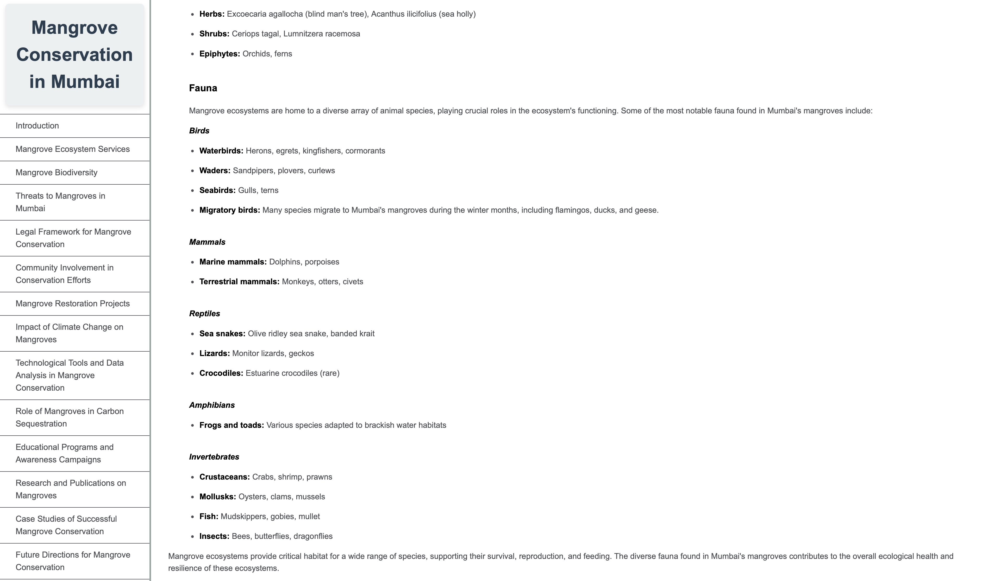

Mangrove Conservation Technical Documentation 🌿

## Overview

This project is a comprehensive technical documentation on the conservation of mangroves, with a specific focus on the mangrove ecosystems in Mumbai, India. It is designed as an informative resource to raise awareness about the significance of mangroves, the challenges they face, and the various conservation efforts in place to protect these vital coastal ecosystems.

## Project Goals

Highlight the ecological importance of mangroves and the ecosystem services they provide.
Detail the threats faced by mangroves in urban areas like Mumbai, including plastic pollution and urban development.
Showcase community-led conservation initiatives and restoration projects in Maharashtra.
Explore the impact of climate change on mangroves and their role in carbon sequestration.
Demonstrate the use of technological tools like GIS, remote sensing, and drones for monitoring mangrove health.

## Key Features

Interactive Navigation: The documentation is structured with a navigable menu to easily access different sections.
Data Analysis: Includes real-world data on mangrove cover changes, NDVI values, and GIS data layers for mapping.
Case Studies & Best Practices: Showcases successful mangrove conservation efforts.
Figures & Visuals: Utilizes charts, maps, and images to illustrate key points.
References: Extensive list of research articles, reports, and case studies for further reading.

## Technologies Used

HTML5 & CSS3: For structuring and styling the documentation.
JavaScript (optional): Can be used for enhancing interactivity if needed.
Visual Studio Code: Development environment.
Git & GitHub: Version control and collaboration.

## Sections Included

Introduction
Mangrove Ecosystem Services
Mangrove Biodiversity
Threats to Mangroves in Mumbai
Legal Framework for Conservation
Community Involvement
Mangrove Restoration Projects
Impact of Climate Change
Technological Tools & Data Analysis
Role in Carbon Sequestration
Educational Programs
Case Studies of Successful Conservation
Future Directions
References

## Screenshots

## How to use

1. Clone the repository:
   git clone https://github.com/docmischa990/mangrove-conservation-TD.git

2. Open the index.html file in your browser to explore the documentation.

## Future Plans

Integrate JavaScript for interactive data visualizations.
Expand the dataset for more comprehensive analyses.
Add multilingual support to reach a wider audience.

## Contributing

Contributions are welcome! Feel free to open issues or submit pull requests for improvements.

## License

This project is licensed under the MIT License.

